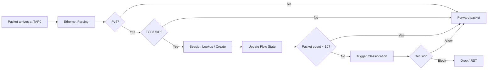
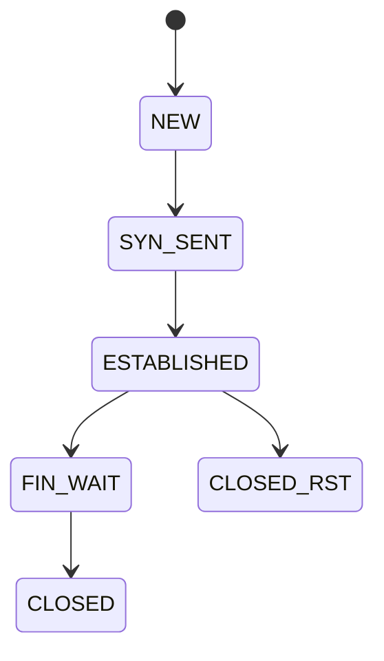
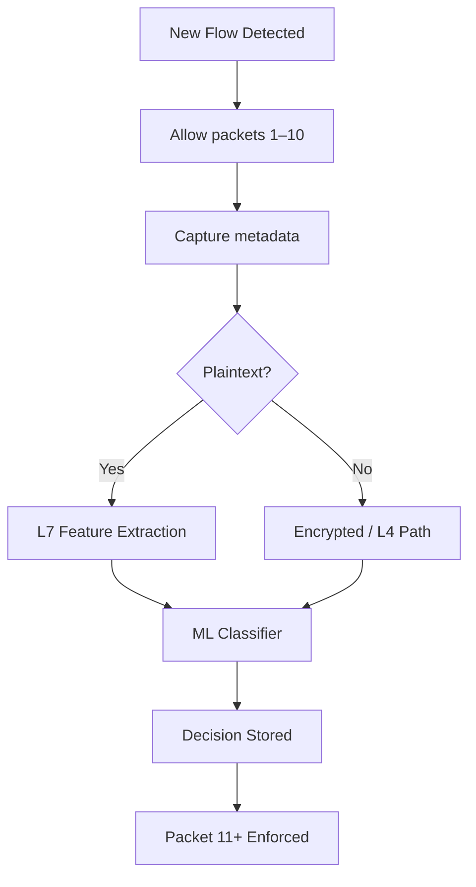
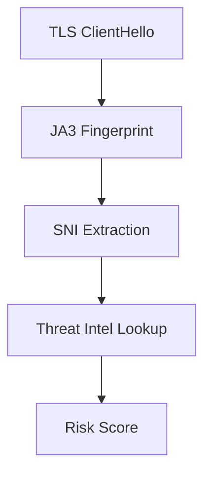
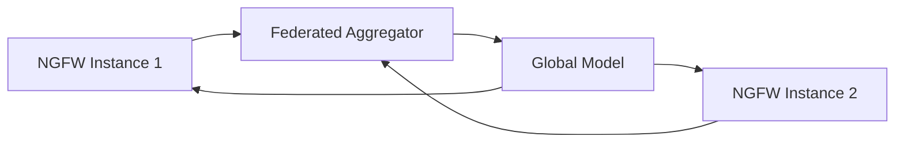
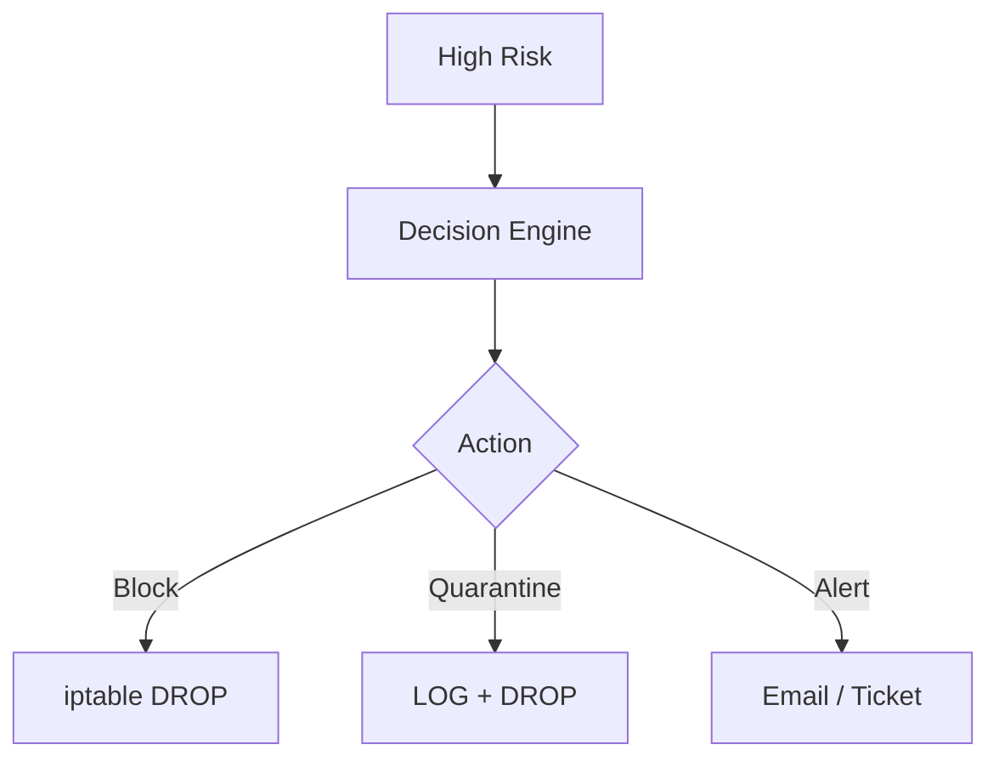
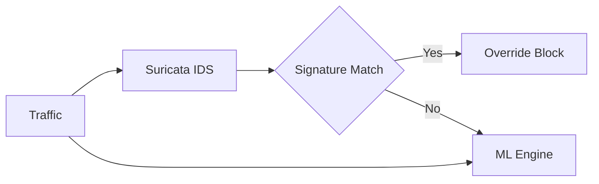
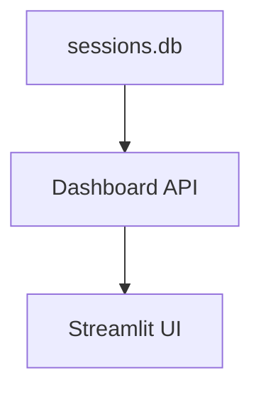

# 🔐 AI-Driven Next-Generation Firewall (NGFW)

## Architecture, Flow & Intelligence Overview

---

## 📍 High-Level System View

This NGFW is designed as an **inline enforcement system**, operating directly on live traffic paths.

```
[ Client / Endpoint ]
        |
     (Router)
        |
      TAP0
        |
+-------------------+
|   NGFW ENGINE     |
|-------------------|
| Forwarder (L2–L4) |
| Flow Tracker      |
| ML Classifier     |
| Anomaly Engine    |
| SOAR Controller   |
+-------------------+
        |
      TAP1
        |
   (Core Switch)
        |
   [ Servers / DC ]
```

---

## 🔁 Inline Packet Processing Flow



---

## 🧠 Session Lifecycle



---

## 📦 First-10-Packet Decision Logic



---

## 📊 Feature Extraction (Examples)

| Category | Features |
|--------|----------|
| Timing | Duration, inter-arrival |
| Volume | Bytes / packets |
| TCP | Window, seq numbers |
| Network | TTL asymmetry |
| Heuristics | Small-packet flags |

---

## 🔐 Encrypted Traffic Intelligence



---

## 🧬 Federated Learning Topology



---

## 🤖 SOAR Automation



---

## 🛡 IDS + ML Hybrid



---

## 📊 Dashboard Data Flow



---

## 🧪 Realism & Validation

✔ Inline enforcement  
✔ GNS3-based realistic topology  
✔ SOAR tested under load  
✔ ~1.2 Gbps throughput observed  

---

## 🧠 Design Philosophy

> If it cannot run inline on real traffic, it is not a firewall.
